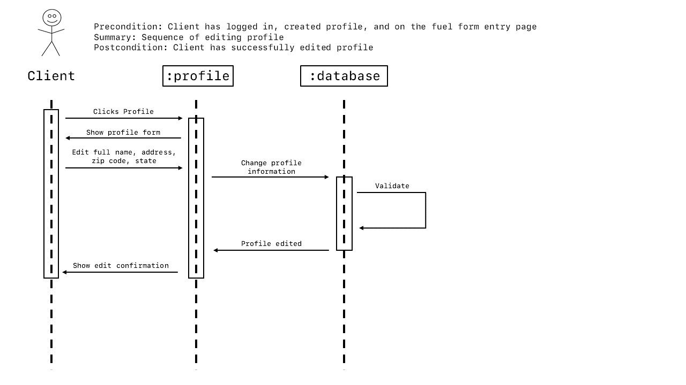

# COSC 4353 Software Design Project

## Fuel Rate Prediction Software: Front End

### Jonathan Henry & Bhavya Merchant

#### Sequence Diagrams

There are four major modules that need sequence diagrams: Login, Profile, Fuel Quote, and Fuel History. There are three sequences for the login page. The diagrams are shown below with their summary.

#### Design and Methodology Changes

There are some changes made to the design

1. Angular is no longer being used. We are now using JavaScript with Swing for the GUI.

2. The main page after login is now the fuel quote form. Links to edit the profile and view the fuel quote history are included on the fuel quote page.

3. The date and time is stored with the fuel quote history so client can see when the quotes were requested.

4. The client must login after registration.

#### Front End Technologies

	We used javascript for our front end technology. The GUI Swing was used to develop the front end. Jonathan Henry was responsible for the majority of coding in the GUI, and Bhavya Merchant was responsible for the sequence diagrams.
	The reason we decided to use Javascript was because of the ease and knowledge from previous experiences. We decided to use the GUI Swing because of the rudementary knowledge required to use it.

#### Screenshots of the Front End

	We were unable to populate the fuel history because we do not have a database. Once the database is created we can show history of clients. Images have been committed showing the different stages of the application running.
	
The following github link will allow you to run the program and validate requirements. An "existing" client has a username of "username" and a password of "password".
	
 	GITHUB LINK: https://github.com/Twxwt/FuelProject.git